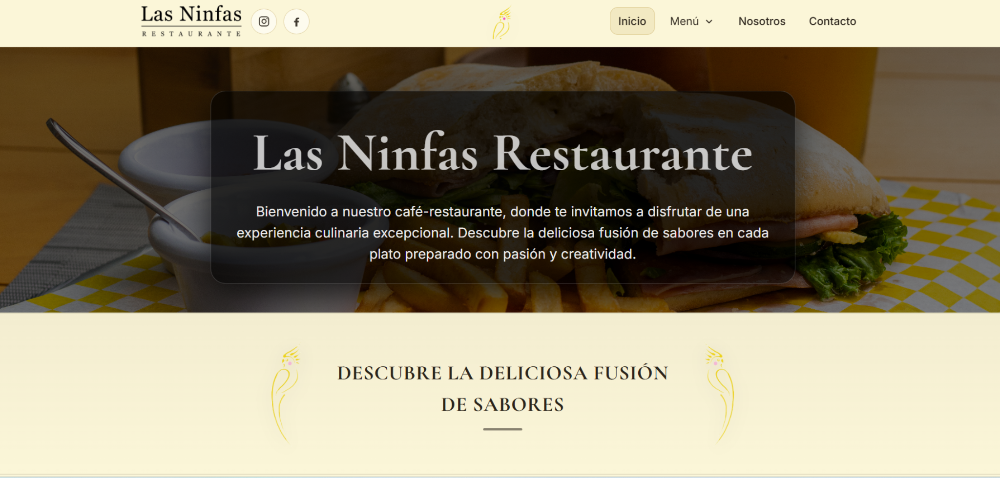

# Las Ninfas Restaurant Website

Landing page multipágina para un restaurante desarrollada con **HTML, CSS y JavaScript**.

Este proyecto fue desarrollado para un restaurante local y forma parte de mi portafolio de desarrollo frontend.

## Live Demo

[View website](https://johannesguzman.github.io/lasninfas/)


## Preview




---

##  Características

- Diseño responsive
- Navegación con menú dropdown
- Slider de imágenes
- Galería visual
- Página "Nosotros"
- Página de contacto con mapa
- Integración de menú en PDF
- Lightbox para imágenes

---

## Tecnologías utilizadas

- HTML5
- CSS3
- JavaScript (Vanilla JS)

## Estructura del proyecto

```
lasninfas-project/
│
├── index.html
│
├── pages/
│   ├── contacto.html
│   └── nosotros.html
│
├── assets/
│   ├── css/
│   │   └── style.css
│   │
│   ├── js/
│   │   └── script.js
│   │
│   ├── img/
│   │
│   └── pdf/
│
├── README.md
└── LICENSE
```


---

1. Clonar el repositorio

```bash
git clone https://github.com/JohannesGuzman/lasninfas.git
```

2. Abrir el archivo:

```
index.html
```

en el navegador.


## Objetivo del proyecto

Este proyecto fue desarrollado para:

- crear un sitio web moderno para un restaurante local
- practicar estructura semántica en HTML
- organizar proyectos frontend de forma profesional
- implementar diseño responsive con CSS
- agregar interactividad con JavaScript vanilla


## Autor

Johannes Guzmán Guerrero
Frontend Developer


##  License

This project is licensed under the MIT License.

Images, logos and brand assets belong to their respective owners.
